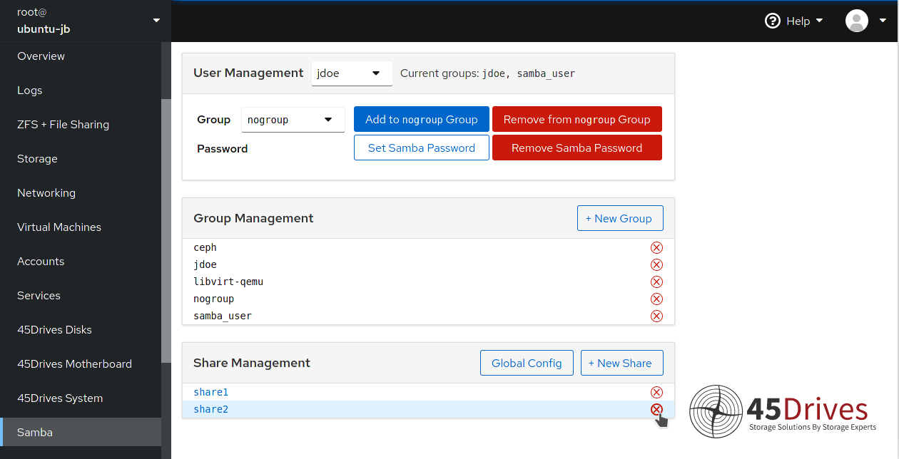
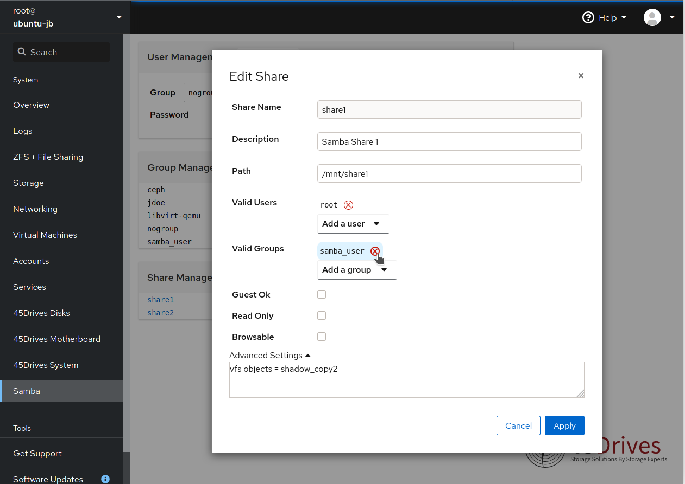

# Cockpit Samba Manager
A Cockpit plugin to make managing SMB shares easy.

*Main Page*

*Editing a Share*
# Installation
## From Github Release
### Ubuntu
1. `$ wget https://github.com/45Drives/cockpit-samba-manager/releases/download/v1.0.2/cockpit-samba-manager_1.0.2-2focal_all.deb`
1. `# dpkg -i cockpit-samba-manager_1.0.2-2focal_all.deb`
1. [Edit Samba configuration](#samba-configuration)
### RHEL7
1. `# yum install https://github.com/45Drives/cockpit-samba-manager/releases/download/v1.0.2/cockpit-samba-manager-1.0.2-3.el7.noarch.rpm`
1. [Edit Samba configuration](#samba-configuration)
## From Source
1. `$ git clone https://github.com/45Drives/cockpit-samba-manager.git`
1. `$ cd cockpit-samba-manager`
1. `# make install`
1. [Edit Samba configuration](#samba-configuration)
## From 45Drives Repositories
### Ubuntu
1. Import GPG Key
```sh
wget -qO - http://images.45drives.com/repo/keys/aptpubkey.asc | sudo apt-key add -
```
2. Add 45drives.list
```sh
cd /etc/apt/sources.list.d
sudo wget http://images.45drives.com/repo/debian/45drives.list
sudo apt update
```
3. Install Package
```sh
sudo apt install cockpit-samba-manager
```
### RHEL7
1. Add Repository
```sh
cd /etc/yum.repos.d
sudo wget http://images.45drives.com/repo/centos/45drives-centos.repo
sudo yum clean all
```
2. Install Package
```sh
sudo yum install cockpit-samba-manager
```
# Samba Configuration
/etc/samba/smb.conf:
```ini
[global]
include = registry
```
